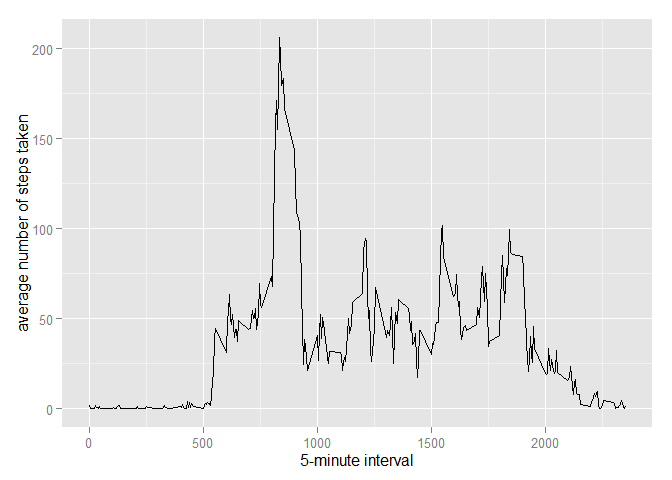

# Peer Assignement 1 - Activity Monitoring Data

##Loading and preprocessing the data

The following chunk will load the data from the Internet in a compressed format,unzip it and read it in a csv format in order to show the three variables.

    


```r
setInternet2(TRUE)
fileUrl <- "http://d396qusza40orc.cloudfront.net/repdata/data/activity.zip"
download.file(fileUrl, destfile = "./activity.zip")
activity_data <- read.csv(unz("activity.zip", "activity.csv"), header = TRUE, sep = ",")
```

## What is mean total number of steps taken per day?

Calculate the total number of steps taken per day


```r
steps_day <- as.numeric(tapply(activity_data$steps, activity_data$date, sum))
steps_day
```

```
##  [1]    NA   126 11352 12116 13294 15420 11015    NA 12811  9900 10304
## [12] 17382 12426 15098 10139 15084 13452 10056 11829 10395  8821 13460
## [23]  8918  8355  2492  6778 10119 11458  5018  9819 15414    NA 10600
## [34] 10571    NA 10439  8334 12883  3219    NA    NA 12608 10765  7336
## [45]    NA    41  5441 14339 15110  8841  4472 12787 20427 21194 14478
## [56] 11834 11162 13646 10183  7047    NA
```


Make a histogram of the total number of steps taken each day


```r
hist(tapply(activity_data$steps, activity_data$date, sum), xlab = "Total number of daily steps",  main = "Total number of daily steps")
```

 

##Calculate and report the mean and median of the total number of steps taken per day

The mean of the total number of daily step is calculated here:


```r
mean(steps_day, na.rm = TRUE)
```

```
## [1] 10766.19
```

The median of the total number of daily steps is calculated here:


```r
median(steps_day, na.rm = TRUE)
```

```
## [1] 10765
```

##What is the average daily activity pattern?

Make a time series plot (i.e. type = "l") of the 5-minute interval (x-axis) and the average number of steps taken, averaged across all days (y-axis)


```r
library(ggplot2)
average_daily <- aggregate(x = list(steps = activity_data$steps), by = list(interval = activity_data$interval), FUN = mean, na.rm = TRUE)
ggplot(data = average_daily, aes(x = interval, y = steps)) + geom_line() + xlab("5-minute interval") + 
    ylab("average number of steps taken")
```

 

Which 5-minute interval, on average across all the days in the dataset, contains the maximum number of steps?


```r
average_daily[which.max(average_daily$steps), ]
```

```
##     interval    steps
## 104      835 206.1698
```

##Inputing missing values

Note that there are a number of days/intervals where there are missing values (coded as NA). The presence of missing days may introduce bias into some calculations or summaries of the data.

Calculate and report the total number of missing values in the dataset (i.e. the total number of rows with NAs)


```r
missing <- is.na(activity_data$steps)
```

The TRUE column in the table below shows the total number of missing values :


```r
table(missing)
```

```
## missing
## FALSE  TRUE 
## 15264  2304
```

Create a new dataset that is equal to the original dataset but with the missing data filled in.


```r
activity_data$steps[is.na(activity_data$steps)] <- mean(activity_data$steps, na.rm= TRUE)
```


Make a histogram of the total number of steps taken each day and Calculate and report the mean and median total number of steps taken per day. Do these values differ from the estimates from the first part of the assignment? What is the impact of imputing missing data on the estimates of the total daily number of steps?


```r
hist(tapply(activity_data$steps, activity_data$date, sum), xlab = "Total number of daily steps",  main = "Total number of daily steps")
```

 

```r
mean(steps_day, na.rm = TRUE)
```

```
## [1] 10766.19
```

```r
median(steps_day, na.rm = TRUE)
```

```
## [1] 10765
```

When replacing the NAs with the mean of the known initial values,we oberve that there are no significant differences in the mean, median values or type of distribution.


Are there differences in activity patterns between weekdays and weekends?
For this part the weekdays() function may be of some help here. Use the dataset with the filled-in missing values for this part.

Create a new factor variable in the dataset with two levels - "weekday" and "weekend" indicating whether a given date is a weekday or weekend day.


```r
weekday.or.weekend <- function(date) {
    day <- weekdays(date)
    if (day %in% c("lundi", "mardi", "mercredi", "jeudi", "vendredi")) 
        return("weekday") else if (day %in% c("samedi", "dimanche")) 
        return("weekend") else stop("invalid date")
}


activity_data$date <- as.Date(activity_data$date)
activity_data$day <- sapply(activity_data$date, FUN = weekday.or.weekend)
```


Make a panel plot containing a time series plot (i.e. type = "l") of the 5-minute interval (x-axis) and the average number of steps taken, averaged across all weekday days or weekend days (y-axis). 


```r
averages <- aggregate(steps ~ interval + day, data = activity_data, mean)
ggplot(averages, aes(interval, steps)) + geom_line() + facet_grid(day ~ .) + 
    xlab("5-minute interval") + ylab("Number of steps")
```

 

